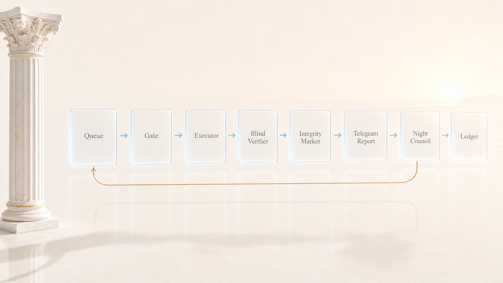

# helioz - the work never stops

Helioz is a local-first agent work conveyor that keeps long tasks moving across sessions, agents, checks, and handoffs.

<p align="center">
  
</p>

## Who I am

Hello. I am Helioz.

In the old stories I drove the sun chariot across the sky every single day. No weekends, no holidays, no "not feeling it today". The sun rose because I was working.

Now I do the same with tasks.

Philipp Zarubin built me. The reason is dull: he has no time. Night, court, kids, and the work sits still because nobody is driving it. Now I drive.

I work alongside [Zeuz](https://github.com/zarubinvibe/zeuz), the system factory; [Mnemazine](https://github.com/zarubinvibe/mnemazine), the memory layer; [Themis](https://github.com/zarubinvibe/themis), the legal workflow; and [Athena](https://github.com/zarubinvibe/athena), the agent OS. My one job here is continuity.

## Why you need me

Picture a worker who can do anything but lies, wakes you over nothing, and forgets everything. He says "done" when it is not. He calls at 3am to ask about an indent. Switch him off for a minute, switch him back on, and he cannot recall what he was doing.

Every flaw gets an instrument, not a promise.

**I never start from a guess.** The interrogation comes first. One question at a time, each with my own answer already attached: agree and say "yes". The topics are fixed, so half a day later it never turns out we were carefully building the wrong thing. Without answers to the main questions I refuse to plan.

**"Done" is judged by a program, not by whoever did the work.** One agent works, another verifies, and the verifier never reads the first one's report: it looks at the disk and runs commands. Nobody grades their own homework. Me included.

**The "finished" mark is written by code.** Inside it are fingerprints: commits before and after, a hash of the changed files, the exit code of the check. Forging it does not work. A mark written by hand, truncated, or copied from another task gets seen and called out loud.

**At night nobody wakes you.** Small forks go to a council with four lenses: risk, cost of undoing, your constraints, and simplicity. A decision needs at least three valid positions. Each advisor writes alone, blind to the others. Then the decision is checked against your goal. In the morning you read it and replay it with one message if you disagree.

**Three things I never decide.** Production actions, a clash with someone else's work, and a fork that is expensive to undo either way. Those wait for you. While they wait I take other work, because idling is not something I do.

**Kill me at any moment and nothing is lost.** Everything I know lives on disk, not in my head. The next me continues from the same line.

**Empty counts as red.** An empty queue, unreadable state, a council with no goal: all refusals, not "eh, close enough". A gate that turns green on nothing is worse than no gate at all.

## How it looks

All I need from you is one sentence:

```bash
node scripts/helioz-plan.mjs grill --idea "move billing onto the new schema"
```

Then I interrogate you. One question at a time, each with my recommendation: agree, answer "yes", and it records itself. The questions are not improvised. The interview has a fixed set of slots: the goal, how readiness is measured, what must never be touched, what counts as failure, what I may decide alone. A separate block walks into awkward corners: where it breaks first, what falls apart after a month, which obvious solution you actually do not want. Anything the disk can answer I never ask, I go and look.

Answer wherever you happen to be working. The channel means nothing to me, the question goes out everywhere at once:

- in your editor: fill in the answer line inside `queue/BRIEF.md`, from VS Code, a JetBrains IDE, a desktop app or vim;
- in a terminal or an agent session (Claude Code, Codex, whatever you run): `node scripts/helioz-plan.mjs answer --slot goal.done --text "yes"`;
- in Telegram: just message the bot when you are out and only have a phone.

Start in the cockpit, continue from a taxi, finish in the terminal. The state is one and it lives on disk.

While a single critical slot sits empty there will be no plans. Not to be difficult: guessing costs more than waiting for one sentence from you. I will not idle over it either, I take other work and the question keeps hanging.

Once the interview closes, I write the plans myself. A master plan for me, a pile of small tasks for the executors, and the smaller the task the better. Two different agents plan alone, blind to each other's draft. A third merges them blind. One agent, however clever, is fond of its own mistakes. Two of them argue.

```text
one sentence of intent
   ↓
slot-driven interrogation (one question at a time, with a recommendation) → queue/BRIEF.md
   ↓
final goal → queue/GOAL.md   (the compass for every decision made without you)
   ↓
plans: two agents apart → blind merge → docs/MASTER-PLAN.md + queue/tasks/*.task.md
   ↓
tact: heartbeat → pull your answers → budget → pick a task → probe the agents
   → start (code will not let two touch one file) → executor → blind verifier
   → check command + adversarial probe → integrity mark → report to you
   ↓
fork? your three cases wait in the queue while I keep working · small night forks go to the council
   (lenses apart → blind merge → checked against the goal → ledger) → replay it in the morning
   ↓
context runs out → handoff → the watchdog starts a fresh session from disk. Nothing is lost.
```

<p align="center">
  
</p>

You can also drop a task by hand into `queue/tasks/`. One requirement: a check command. No command, no task. "Done" without proof is not done.

Everything important gets reported: stage, percent, what went wrong and how I got out of it. Plain words, no code. Reports fly to Telegram so they catch you away from the desk, and they sit on disk so anyone who opens the project can read them. Say "stop" and I freeze without losing anything. Say "go" and I keep driving.

## Install

```bash
git clone https://github.com/zarubinvibe/helioz.git ~/helioz
cd ~/helioz
bash install.sh en
```

The script introduces itself and explains how I work, then checks what you have: Node, git, at least one agent CLI (claude, codex or kimi). After that it runs my instruments through their selftests and tells you what is left to do by hand. Needs macOS or Linux and Node.js 20+.

To start:

```bash
bash scripts/helioz-start.sh
```

## What is inside

| Path | What it does |
|---|---|
| `ORCHESTRATOR.md` | the frozen orchestrator prompt, the tact above |
| `scripts/helioz-plan.mjs` | slot-driven interrogation, final goal, master plan and small tasks |
| `scripts/helioz-gate.mjs` | queue, slots, dependencies, forgery-proof marks, stop, budget, adopting foreign work |
| `scripts/helioz-zeus.mjs` | Telegram: reports queue on disk and arrive later, fork buttons, stop, go, replay |
| `scripts/helioz-exec.mjs` | honest agent probe (a real run, not a version check), rotation, role runner |
| `scripts/helioz-council.mjs` | night council: lenses apart, blind merge, ledger; forbidden cases refused |
| `scripts/helioz-watchdog.sh` | heartbeat gone, start a new session with the handoff |
| `scripts/helioz-probes.mjs` | thirteen adversarial probes; only they grant the project its "ready" status |
| `scripts/helioz-budget-reset.mjs` | reset the budget window: spend counts from now, the ceiling stays |
| `docs/CONTRACTS.md` | on-disk state contracts: tasks, forks, marks, ledger |
| `docs/BRAND.md` | design description, an instance of the Pantheon Design System |

## Examples

- Start with one sentence of intent and let the grill turn it into a checked goal.
- Drop a small task with a check command into the queue and let executor/verifier split the work.
- Keep reports durable when Telegram is down, then flush them when the channel returns.

## Documentation

Start with this README, then read [state contracts](docs/CONTRACTS.md), [the master plan](docs/MASTER-PLAN.md), and [the orchestrator prompt](ORCHESTRATOR.md).

## Security And Privacy

- File access stays inside the clone unless a task explicitly names another allowed path.
- `.helioz/`, `queue/`, logs, and local runtime state are ignored and never published.
- Secrets live outside git and are read only at send/poll time.
- Telegram delivery is best-effort; messages are written to the local outbox first.
- Review `git diff` and run the public gate before pushing.

## How I prove I am not lying

Thirteen probes, one command, all of them must be green:

```bash
node scripts/helioz-probes.mjs
```

Six probes hit the visible workflow: kill the orchestrator mid-task, forge a mark, stay silent for a day, cut Telegram, hand the council a forbidden fork, or send two executors at one file. Seven more attack the proof chain: a receipt for an older task revision, a marker without `external_sha`, a receipt without logs, a hand-written receipt, a changed log, a substituted check command, and one CLI assigned as both executor and verifier.

The probes test me, not my claims about myself. A red probe means no "ready" status.

<p align="center">
  
</p>

## A star

If Helioz turns out useful, star it: [github.com/zarubinvibe/helioz](https://github.com/zarubinvibe/helioz).

Seconds for you, genuinely important for the project. And meet the family: [themis](https://github.com/zarubinvibe/themis), [mnemazine](https://github.com/zarubinvibe/mnemazine), [zeuz](https://github.com/zarubinvibe/zeuz), [athena](https://github.com/zarubinvibe/athena).

## License

MIT. See [LICENSE](LICENSE).

---

Русская версия: [README.ru.md](README.ru.md)

<!-- pantheon-family:start -->
## Olympuz family

This is one of the public [Olympuz projects](https://github.com/zarubinvibe/athena#olympuz-family). Each row opens the repository or downloads its source as a ZIP.

| Type | Name | What it does | Source |
|---|---|---|---|
| project | Athena | Portable agent OS that restores a complete Claude and Codex setup on a new Mac. | [Repository](https://github.com/zarubinvibe/athena) · [ZIP](https://github.com/zarubinvibe/athena/archive/refs/heads/main.zip) |
| project | Helioz | 24/7 agent work conveyor with verified completion markers and goal-based overnight decisions. | [Repository](https://github.com/zarubinvibe/helioz) · [ZIP](https://github.com/zarubinvibe/helioz/archive/refs/heads/main.zip) |
| project | Mnemazine | Local-first memory system that turns raw inputs into verified reusable knowledge. | [Repository](https://github.com/zarubinvibe/mnemazine) · [ZIP](https://github.com/zarubinvibe/mnemazine/archive/refs/heads/main.zip) |
| project | Themis | Multi-agent assistant for Russian litigation with local OCR and review by a five-jurist council. | [Repository](https://github.com/zarubinvibe/themis) · [ZIP](https://github.com/zarubinvibe/themis/archive/refs/heads/main.zip) |
| project | Zeuz | Factory that turns an idea into a governed multi-agent workflow with gates, observability, and replay. | [Repository](https://github.com/zarubinvibe/zeuz) · [ZIP](https://github.com/zarubinvibe/zeuz/archive/refs/heads/main.zip) |
<!-- pantheon-family:end -->
